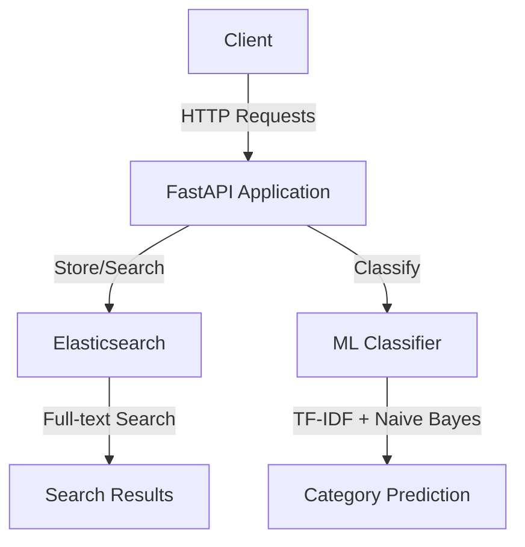
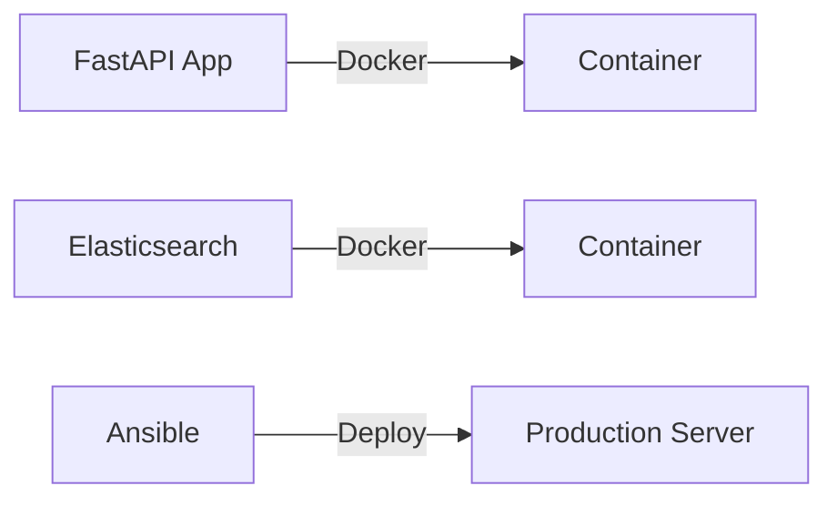
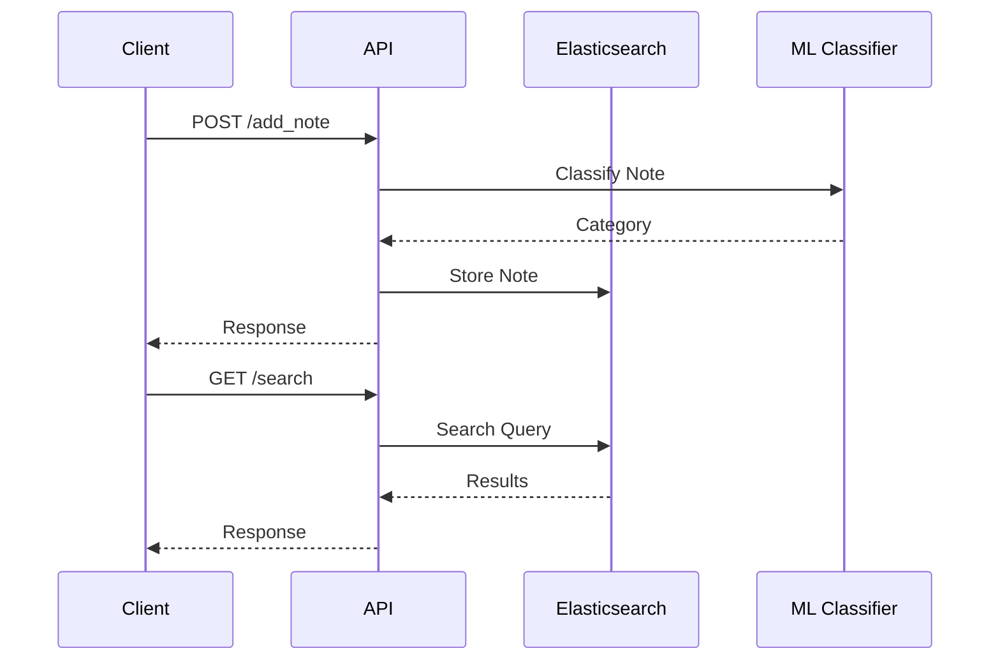
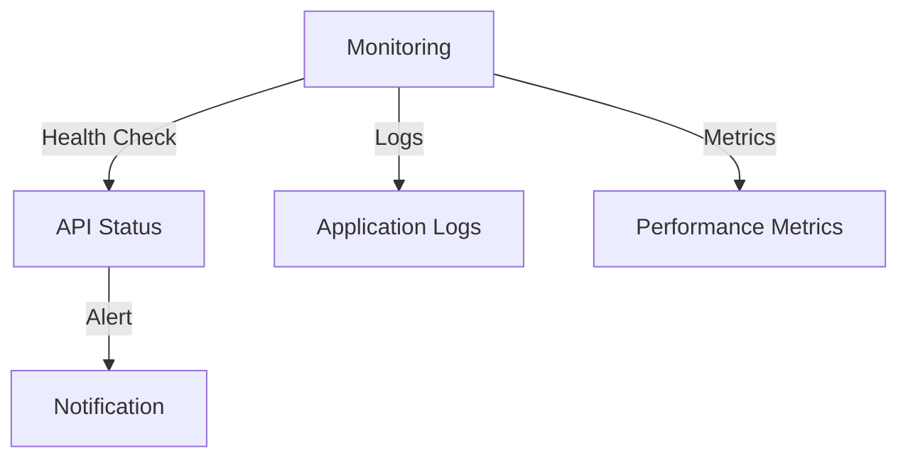

# Notes Search & Classification API

A powerful REST API for storing, searching, and classifying notes using FastAPI, Elasticsearch, and scikit-learn.

## Architecture Overview



## System Components



## Data Flow



## Setup Instructions

### Prerequisites
- Docker and Docker Compose
- Python 3.8+
- Ansible (for deployment)

### Local Development Setup

1. Clone the repository:
```bash
git clone <repository-url>
cd notes-search-api
```

2. Create and configure environment file:
```bash
cp .env.example .env
# Edit .env with your configuration
```

3. Start the services using Docker Compose:
```bash
docker-compose up -d
```

4. Install Python dependencies:
```bash
pip install -r requirements.txt
```

5. Run the application:
```bash
uvicorn main:app --reload
```

### OpenSearch/Elasticsearch Setup

#### Local Development with Docker
1. The OpenSearch service is automatically started via Docker Compose
2. Access OpenSearch at: http://localhost:9200
3. Default credentials:
   - Username: admin
   - Password: admin

#### Manual OpenSearch Setup
1. Download OpenSearch:
```bash
# For Ubuntu/Debian
wget https://artifacts.opensearch.org/releases/bundle/opensearch/2.x/opensearch-2.x.0-linux-x64.tar.gz
tar -xzf opensearch-2.x.0-linux-x64.tar.gz
cd opensearch-2.x.0
```

2. Configure OpenSearch:
```yaml
# config/opensearch.yml
network.host: 0.0.0.0
discovery.type: single-node
plugins.security.disabled: true
bootstrap.memory_lock: true
OPENSEARCH_JAVA_OPTS: "-Xms512m -Xmx512m"
```

3. Set system limits:
```bash
# Add to /etc/security/limits.conf
opensearch soft memlock unlimited
opensearch hard memlock unlimited
opensearch soft nofile 65536
opensearch hard nofile 65536
```

4. Start OpenSearch:
```bash
./bin/opensearch
```

#### Elasticsearch Setup (Alternative)
1. Download Elasticsearch:
```bash
wget https://artifacts.elastic.co/downloads/elasticsearch/elasticsearch-8.10.0-linux-x86_64.tar.gz
tar -xzf elasticsearch-8.10.0-linux-x86_64.tar.gz
cd elasticsearch-8.10.0
```

2. Configure Elasticsearch:
```yaml
# config/elasticsearch.yml
network.host: 0.0.0.0
discovery.type: single-node
xpack.security.enabled: false
bootstrap.memory_lock: true
ES_JAVA_OPTS: "-Xms512m -Xmx512m"
```

3. Start Elasticsearch:
```bash
./bin/elasticsearch
```

### Testing the Application

1. Run the test data script:
```bash
python test_data.py
```

2. Test API endpoints manually:
```bash
# Add a note
curl -X POST http://localhost:8000/notes \
  -H "Content-Type: application/json" \
  -d '{"title": "Test Note", "content": "This is a test note about technology and programming."}'

# Search notes
curl "http://localhost:8000/search?keyword=technology"

# Check health
curl http://localhost:8000/health

# Get categories
curl http://localhost:8000/categories
```

3. Access the API documentation:
- Open http://localhost:8000/docs in your browser
- Test endpoints directly from the Swagger UI

## API Endpoints

### Add Note
```bash
POST /notes
{
    "title": "Meeting Notes",
    "content": "Discuss project timeline and budget"
}
```

### Search Notes
```bash
GET /search?keyword=project&category=Work&page=1&size=10
```

### Health Check
```bash
GET /health
```

### Get Categories
```bash
GET /categories
```

## Deployment with Ansible

1. Configure your inventory file:
```ini
[production]
your-server ansible_host=your-server-ip
```

2. Run the playbook:
```bash
ansible-playbook -i inventory.ini deploy.yml
```

## Monitoring and Maintenance



## Troubleshooting

### Common Issues

1. OpenSearch/Elasticsearch Connection Issues:
```bash
# Check if service is running
curl http://localhost:9200

# Check logs
docker-compose logs opensearch

# Reset data (if needed)
docker-compose down -v
docker-compose up -d
```

2. Memory Issues:
```bash
# Check system memory
free -m

# Adjust OpenSearch memory settings in docker-compose.yml
OPENSEARCH_JAVA_OPTS: "-Xms512m -Xmx512m"
```

3. Permission Issues:
```bash
# Fix OpenSearch data directory permissions
sudo chown -R 1000:1000 opensearch-data/
```

## Contributing
1. Fork the repository
2. Create your feature branch
3. Commit your changes
4. Push to the branch
5. Create a Pull Request

## License
MIT License 